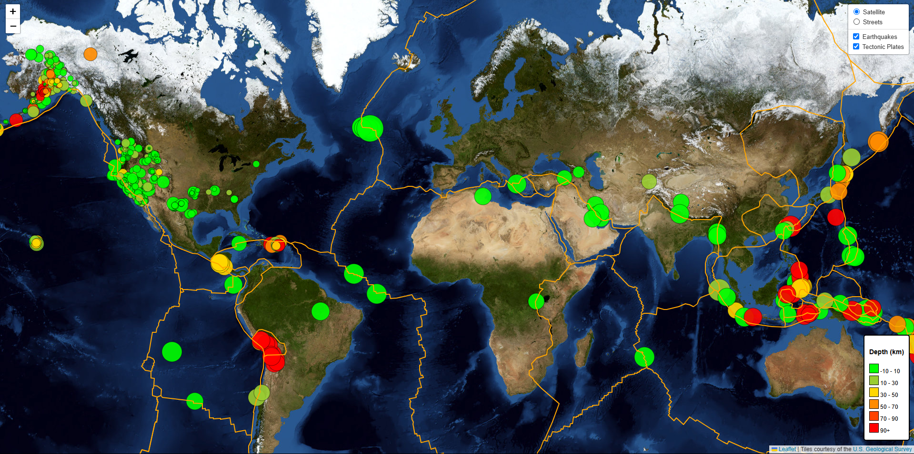

# LeafLet Assignment
All the code for the application logic has been implemented in the [`logic.js`](./docs/static/js/logic.js) file.

## Map
- Both **TileLayers** (satellite and street) load without errors.
- Bother **Overlays** (earthquake and tectonic plates) load without errors.
- Connects to GeoJSON API using D3 without errors.
- Markers are added with sizes corresponding to earthquake magnitudes.
- A legend showing depth and corresponding colors is added (**if the Earthquake overlay is hidden, the legend also gets hidden, and vice versa**).

### Screenshots
- Satellite tile layer with both overlays:
  
- Street tile layer with earthquake overlay:
  
- Satellite tile layer with tectonic plates overlay:
  

## Data Points
- Data points scale with magnitude levels.
- Data points colors change with depth levels.
- Each point has a tooltip with the location, magnitude, and depth.
- All data points load in the correct locations.

## Deployment
The app has been successfully deployed to Github Pages ([View Here](https://arzingy.github.io/leaflet-challenge/)).
